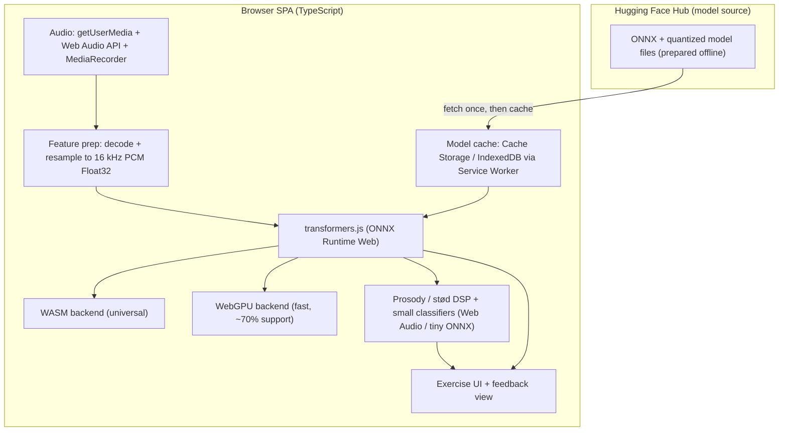
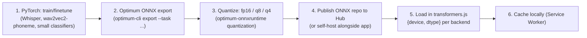
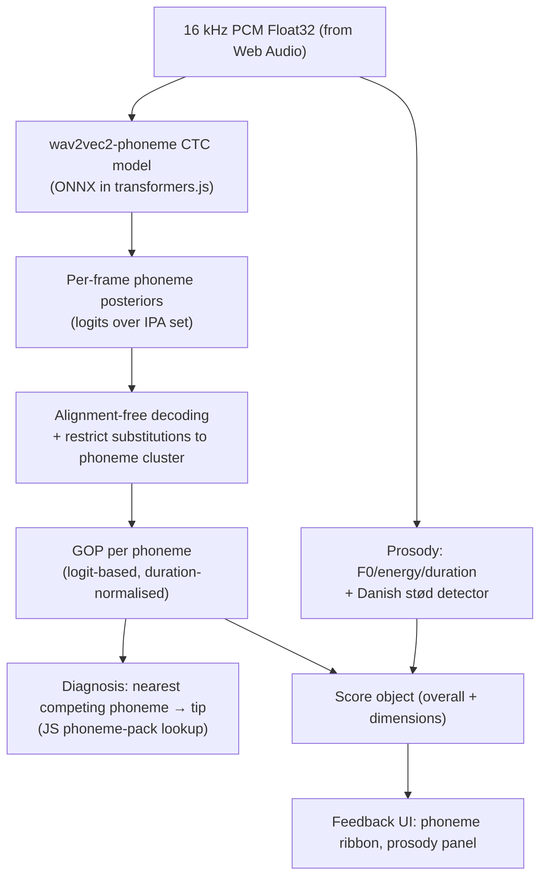

# Browser-Based Pronunciation Training
## Technical Design — Preparing and Running Open Models In the Browser
### Danish · English · Newari (Nepal Bhasa) · Nepali

---

## Question

The team will create/finetune its own models or use open models. The question this design answers: **how do we prepare those models for, and run them inside, a web browser** so that pronunciation training (capture → phoneme scoring → feedback) works on-device — including for the four very different languages Danish, English, Newari, and Nepali?

This design deliberately de-emphasises server-side scoring (covered separately) and focuses on the **browser-execution story**: the runtime stack, the model-preparation pipeline from PyTorch to ONNX, which model does what in the browser, per-language readiness, and performance/size trade-offs.

---

## Executive Summary

1. **The browser is now a viable inference runtime.** transformers.js v3 + ONNX Runtime Web runs models on **WebGPU** (fast) or **WASM** (universal fallback). WebGPU support reached ~70% of browsers in late 2024 and is now production in Firefox 141 and expanding in Safari. A real-time Whisper WebGPU demo already transcribes in-browser on mid-range laptops.
2. **Phoneme posteriors are the key to in-browser pronunciation scoring.** A CTC phoneme model emits per-frame IPA probabilities directly, enabling **alignment-free GOP** without a forced aligner or lexicon. `Wav2Vec2Phoneme` (XLSR/`wav2vec2-lv-60-espeak-cv-ft`) does exactly this, and a **browser-ready ONNX build already exists** (`onnx-community/wav2vec2-lv-60-espeak-cv-ft-ONNX`). This makes the core scorer runnable on-device today.
3. **Zero-shot cross-lingual phoneme transfer is the unlock for Newari.** Wav2Vec2Phoneme can decode **unseen languages in a single forward pass** by mapping training phonemes to the target via articulatory features — directly relevant to Newari, which has almost no annotated data. A Newari-finetuned CTC model is still the goal, but zero-shot IPA recognition is a working starting point in-browser.
4. **Model preparation is a fixed pipeline: PyTorch train/finetune → Optimum ONNX export → quantize (fp16/q8/q4) → publish to the Hub → load in transformers.js.** transformers.js cannot train; all training is offline in Python. Quantization cuts model size ~75% (int8) or more (int4), essential for browser download size.
5. **Per-language readiness differs sharply.** English is shippable today from open models; Nepali fine-tunes well from Whisper/wav2vec2 on small corpora; Danish needs a stød detector (lightweight DSP + small classifier, not a big ASR); Newari relies on cross-lingual transfer + an eventual tiny finetuned CTC model.
6. **A caveat shapes the design: wav2vec2-style conv models can be SLOWER on WebGPU than WASM** for some workloads (reported in ONNX Runtime issue #21618). The design therefore does **backend selection per model/task**, not "WebGPU everywhere", and keeps the GOP scorer (the latency-critical path) lean.
7. **The whole scoring loop can run in-browser**: `getUserMedia` → 16 kHz PCM → wav2vec2-phoneme posteriors → alignment-free CTC GOP + diagnosis from a JS phoneme-pack → prosody/stød DSP → structured score object. No audio leaves the device in the default path.

---

## Methodology

- **Search angles:** (1) browser inference runtimes (transformers.js v3, ONNX Runtime Web, WebGPU vs WASM); (2) the model-preparation pipeline (Optimum ONNX export, quantization dtypes); (3) phoneme-recognition models suitable for pronunciation scoring (Wav2Vec2Phoneme, `wav2vec2-lv-60-espeak-cv-ft`, XLSR fine-tuning, zero-shot cross-lingual transfer); (4) in-browser ASR reality (Whisper WebGPU demos, model sizes, quantization, streaming/chunking); (5) audio capture/feature-extraction in browser and model caching for offline.
- **Source types:** official library docs (HF transformers.js, ONNX Runtime), HF model cards, peer-reviewed/arXiv papers on Wav2Vec2Phoneme and cross-lingual phoneme transfer, GitHub issues with empirical WebGPU-vs-WASM results, browser vendor blogs.
- **Limitations:** latency numbers vary heavily by device/GPU; the "wav2vec2 slower on WebGPU" report is one data point and should be benchmarked per model. Newari browser accuracy is unverified and depends on whether a finetuned model exists at launch.

---

## The Browser Runtime Stack

The platform runs entirely client-side in the default path. Three layers matter.



### Runtime: transformers.js v3 + ONNX Runtime Web
- **transformers.js** is the high-level API: `pipeline('automatic-speech-recognition'|'audio-classification'|'feature-extraction', modelId, { device, dtype })`. It wraps **ONNX Runtime Web**, which executes ONNX graphs on the device.
- **Two execution backends, selected at load time:**
  - **WebGPU** — GPU compute; up to ~5–100× faster than WASM for many models; ~70% browser support (now production in Firefox 141, expanding in Safari). Only a subset of ONNX operators are WebGPU-accelerated.
  - **WASM** — universal fallback; supports all ONNX operators; slower. Use for compatibility and for models that are actually slower on WebGPU.
- **WebNN** is emerging (native NN acceleration) but not yet reliable cross-browser; design treats it as a future optimisation, not a dependency.

### Audio capture & feature prep (all in-browser)
1. `navigator.mediaDevices.getUserMedia({ audio: { echoCancellation:true, noiseSuppression:true, autoGainControl:false } })` — AGC off because dynamics matter for pronunciation.
2. Web Audio `AudioContext` → `MediaStreamAudioSourceNode` → `AnalyserNode` (live viz + RMS VAD) → record.
3. Decode to **16 kHz mono PCM Float32** — the required input for Whisper/wav2vec2. transformers.js can accept a URL/Blob and do this, but doing it explicitly lets you chunk long exercises to ≤30 s (Whisper's window) and trim silence with the VAD.

### Model caching for offline
- Fetch model files once from the Hub, then cache via **Cache Storage / IndexedDB orchestrated by a Service Worker** (PWA "offline-first" pattern). On repeat visits the app shell + cached models load instantly; the scoring path then works fully offline.
- transformers.js supports loading from a custom local/CORS-enabled URL, so you can self-host model files alongside the app and avoid a Hub round-trip entirely.

---

## Model Preparation Pipeline (PyTorch → Browser)

transformers.js **cannot train**. All training/finetuning is offline in Python; only ONNX inference runs in the browser. The preparation pipeline is fixed and language-agnostic:



1. **Train/finetune (Python, GPU offline).** Use Hugging Face Transformers. For pronunciation scoring the key artifact is a **CTC phoneme model** (wav2vec2/XLSR fine-tuned to emit IPA phonemes); for optional transcription, a **Whisper** model.
2. **Export to ONNX** with 🤗 Optimum (`optimum-cli export --task ... --framework pt`). wav2vec2 and Whisper both export cleanly; Conformer-CTC exports too, while Conformer-RNN-T/transducer needs custom JS decoding (prefer **CTC** for the browser).
3. **Quantize** the ONNX graph. Options via `optimum-onnxruntime`: **fp16** (half size, good on WebGPU), **q8/int8** (~75% size reduction, broad support), **q4/int4** (aggressive, for large models). transformers.js v3 selects dtypes per subgraph via `{ dtype: {...} }`.
4. **Publish** the ONNX repo to the Hub (or self-host). The design reuses the **`onnx-community/*`** pattern for browser-ready models.
5. **Load** in transformers.js with an explicit device + dtype per backend (see Backend Selection below).
6. **Cache** locally so subsequent sessions and offline use need no re-download.

### Quantization & size reality (decisive for download size)
- Whisper sizes (fp32 → quantized): **tiny ≈ 75 MB (Q5_1 ≈ 31 MB)**, **base ≈ 142 MB (≈ 57 MB)**, **small ≈ 466 MB (≈ 182 MB)**. int8 ≈ 75% reduction; int4 even smaller.
- wav2vec2-large (the espeak phoneme model) is ~300 MB+ fp32 → quantize hard (q8/q4) to keep first-load acceptable, and cache aggressively.
- A **tiny finetuned wav2vec2** (e.g. a distilled/`Wav2Small`-style 72K–few-M param model) is the goal for Newari so the browser payload stays small.

---

## In-Browser Pronunciation-Scoring Architecture

The scorer runs entirely client-side. It uses **alignment-free CTC GOP** so no forced aligner or lexicon is required in the browser — the critical enabler for low-resource languages.

### The loop


1. **Phoneme posteriors.** The CTC model emits a `[time × phonemes]` logit tensor. Keep the **raw logits** (logit-based GOP), not softmax posteriors, because softmax is overconfident and poorly separates phonemes.
2. **Alignment-free GOP.** Because the target text is known (read-aloud), restrict candidate phonemes to a **phoneme cluster + common learner-error set** and compute GOP against the expected phoneme sequence without forced alignment. This is the robust default — it needs no lexicon, which is exactly why it works for Newari.
3. **Diagnosis.** For each low-GOP phoneme, take the argmax competing phoneme and look up a contrastive tip in the JS **phoneme pack** (IPA inventory + L1→L2 error table). The pack is plain JSON, editable by linguists without rebuilds.
4. **Prosody & stød (DSP, not big ASR).** F0/energy/duration come from Web Audio `AnalyserNode`/ autocorrelation; similarity to a reference template via normalised correlation/DTW. **Danish stød** is detected by creaky-voice features (irregular F0 periods, spectral tilt) at expected positions via a small classifier — this is a lightweight signal-processing task, deliberately not a large model, to keep the browser path fast.

### Reference audio ("model pronunciation")
- **Primary:** browser `SpeechSynthesis` filtered by BCP-47 lang (`da-DK`, `en-*`, `ne-NP`), preferring `localService` voices.
- **Fallback where no OS voice exists (Newari):** pre-recorded human clips bundled as static assets; a slowed-down (0.7×) version via `AudioBufferSourceNode.playbackRate`. Optionally a small neural TTS exported to ONNX, but human clips are the pragmatic launch choice for Newari.

---

## Per-Model Roles & Selection

Each role maps to a model type and a browser treatment. The table is the heart of the design.

| Role | Model type | Browser model | Why this choice | Backend |
|---|---|---|---|---|
| **Phoneme posteriors / GOP** (core scorer) | CTC phoneme recognition (wav2vec2/XLSR) | `onnx-community/wav2vec2-lv-60-espeak-cv-ft-ONNX` (multilingual IPA), then per-language finetuned CTC models | Emits IPA probabilities directly → alignment-free GOP, no aligner/lexicon; zero-shot cross-lingual transfer for unseen languages | Start WASM (conv models can be slower on WebGPU); benchmark, switch per model |
| **Transcription** (optional, free-speaking mode) | Whisper | `onnx-community/whisper-tiny/base` (multilingual) | Best open multilingual ASR; real-time on WebGPU | WebGPU if available, else WASM |
| **Prosody** | DSP in JS (F0/energy/duration) | none (Web Audio) | No model needed; keeps latency low | CPU/JS |
| **Danish stød** | Small classifier | tiny ONNX classifier or rule-based on creaky features | stød is a contrastive creaky-voice event generic ASR misses | WASM (tiny) |
| **Newari scorer** (at maturity) | Finetuned wav2vec2-CTC (tiny) | self-built, proximal transfer from Nepali base | Only ~5.4 h Newari data exists; transfer from Nepali Conformer cuts CER ~52.5%→~17.6% | WASM, quantized |

**Why not Whisper for scoring?** Whisper transcribes words/characters, not IPA phoneme posteriors, and its confidence scores are not phoneme-level. Use Whisper only for the optional free-speaking transcription path. For pronunciation scoring, **CTC phoneme posteriors are the right primitive.**

---

## Per-Language Browser Readiness

| Language | Phoneme-posterior model in browser | Transcription (optional) | Reference TTS | Distinctive handling | Browser readiness |
|---|---|---|---|---|---|
| **English** | espeak multilingual phoneme model works; finetune for GenAm/RP | Whisper tiny/base | OS `SpeechSynthesis` (en-*) | Stress + reduced vowels | **Shippable now** |
| **Danish** | Finetune wav2vec2-CTC on Common Voice Danish; IPA pack with stød | Whisper (Danish) | OS voice (da-DK) where present | **Stød detector** (DSP/classifier) | Medium — needs stød data |
| **Nepali** | Finetune wav2vec2-CTC / Whisper-Nepali (small corpora + augmentation) | Finetuned Whisper-Nepali | OS voice (ne-NP) rare; bundle clips | Gemination, retroflex, 11 vowels | Medium — data small but workable |
| **Newari** | **Zero-shot via cross-lingual transfer** at launch; tiny finetuned CTC model later | Whisper (poor zero-shot) — server-only realistic | **No OS voice; bundle human clips** | Multiple scripts (Newa/Devanagari) | **Low but functional** — transfer first, finetune later |

### Newari strategy detail
Wav2Vec2Phoneme maps training phonemes to the target via **articulatory features** and can decode unseen languages in a single forward pass — so the multilingual espeak model gives a working (if weaker) Newari IPA recognition in-browser **today**, with no Newari training. The product path: (1) ship zero-shot recognition + scripted read-aloud + bundled reference clips; (2) collect/label Newari; (3) finetune a **tiny wav2vec2-CTC by proximal transfer from the Nepali base** (the Nwāchā Munā result: ~52.5%→~17.6% CER); (4) export/quantize and replace the zero-shot model in the cache.

---

## Backend Selection: WebGPU vs WASM (a real trade-off)

- **Default:** detect `navigator.gpu`; prefer WebGPU for Whisper and large models (documented ~5–100× speedups; real-time Whisper on mid-range laptops).
- **Caveat — per model, not global:** wav2vec2-style conv models have been reported **slower on WebGPU than WASM** (ONNX Runtime issue #21618). The scorer (the latency-critical path) must therefore be benchmarked; if a phoneme model is faster on WASM, pin it to WASM even when WebGPU exists.
- **Operator coverage:** WASM supports all ONNX operators; WebGPU only a subset — if export hits unsupported ops, the model silently falls back or errors, so test the exported graph on both.
- **Worker offload:** run inference in a Web Worker (`env.backends.onnx.wasm.proxy` / WebGPU in worker) so the UI thread stays responsive; for lowest latency on small models, `wasm.proxy = false` to run in the main thread.
- **Latency target:** sub-second per short utterance for the scorer; Whisper transcription is best-effort (sub-1s on WebGPU, slower on WASM).

---

## Scoring Pipeline in JS (sketch)

```js
import { pipeline } from "@huggingface/transformers";

// Load the browser-ready multilingual IPA phoneme model (cached after first load)
const phoneme = await pipeline(
  "automatic-speech-recognition",                 // wav2vec2 CTC works here
  "onnx-community/wav2vec2-lv-60-espeak-cv-ft-ONNX",
  { device: "wasm", dtype: "q8" }                  // pinned after benchmarking vs webgpu
);

// pcm: Float32Array @16kHz from Web Audio; targetIpa: ["h","u","n","ə","n"]
const out = await phoneme(pcm, { return_timestamps: "word", chunk_length_s: 30 });
// Access raw logits over IPA set, then alignment-free GOP:
//   for each expected phoneme p_i:
//     restrict candidates to cluster(p_i) ∪ learnerErrors(p_i)
//     GOP_i = logit(p_i) / mean(top-k competing logits)   // logit-based, duration-normalised
//   flag GOP_i < threshold => diagnosed phone = argmax competitor => pack.tip
```

- The phoneme pack (`packs/da.json`, `packs/ne.json`, …) is plain JSON: IPA inventory, G2P mapping, and `learnerErrors[p] → {diagnosed, tip}`. Linguists edit it without touching the model.
- Prosody/stød DSP runs alongside in the same worker; results merge into the score object the UI renders (phoneme ribbon + prosody panel + per-phoneme tips).

---

## Privacy, Offline & Performance

- **Privacy by default:** audio never leaves the device; models run on-device. This is the strongest argument for the browser path for a pronunciation app handling learners' voices.
- **Offline:** Service Worker + Cache Storage/IndexedDB cache the app shell and model files; once cached, scoring works fully offline.
- **First-load cost:** model size dominates. Mitigate with quantization (q8/q4), **lazy per-language loading** (only fetch the model for the selected language), and showing a one-time progress bar; cache aggressively thereafter.
- **Bandwidth:** models are fetched as files, not streamed audio; no per-attempt uploads in the default path.
- **Compatibility:** WASM works everywhere; WebGPU where supported; degrade gracefully (e.g. warn "reduced accuracy / slower" on WASM-only devices).

---

## Risks & Mitigations

| Risk | Impact | Mitigation |
|---|---|---|
| wav2vec2 slower on WebGPU than WASM | Medium | Benchmark per model; pin scorer to fastest backend; keep scorer model small/quantized |
| Newari zero-shot accuracy too weak for feedback | High | Restrict to scripted read-aloud; bundle reference clips; seed thresholds; finetune tiny model asap |
| Danish stød detector needs labelled data | Medium | Start rule-based on creaky-voice features; collect small labelled set; upgrade to tiny classifier |
| Large model first-load deterrring users | High | Lazy per-language loading, q8/q4 quantization, cache, progress UX |
| WebGPU unsupported ops on some exported graphs | Medium | Test export on both backends; fall back to WASM; prefer CTC (simpler) over transducer |
| Model size vs accuracy for Nepali/Newari | Medium | Augment training data; distil to tiny wav2vec2; quantize hard |
| Whisper not a pronunciation scorer | — (design choice) | Use only for optional transcription; use CTC phoneme posteriors for GOP |

---

## Source Notes

| Source | Credibility | Last updated |
|---|---|---|
| [Transformers.js v3: WebGPU Support, New Models & Tasks (Hugging Face)](https://huggingface.co/blog/transformersjs-v3) | 5/5 | 2024-10-22 |
| [Transformers.js docs (Hugging Face)](https://huggingface.co/docs/transformers.js/en/index) | 5/5 | - |
| [Transformers.js GitHub](https://github.com/huggingface/transformers.js/) | 5/5 | - |
| [Audio Processing — Transformers.js DeepWiki](https://deepwiki.com/huggingface/transformers.js/6.2-audio-processing) | 4/5 | - |
| [ONNX Runtime Web — Using WebGPU](https://onnxruntime.ai/docs/tutorials/web/ep-webgpu.html) | 5/5 | - |
| [ONNX Runtime Web tutorials](https://onnxruntime.ai/docs/tutorials/web/) | 5/5 | - |
| [Wav2vec2 slower on WebGPU than WASM — onnxruntime #21618](https://github.com/microsoft/onnxruntime/issues/21618) | 3/5 | - |
| [WebGPU vs WebASM: Browser Inference Benchmarks (SitePoint)](https://www.sitepoint.com/webgpu-vs-webasm-transformers-js/) | 4/5 | - |
| [WebGPU Just Got Real: Firefox 141 & Safari (Zircon)](https://zircon.tech/blog/webgpu-just-got-real-what-firefox-141-and-upcoming-safari-mean-for-ai-in-the-browser/) | 4/5 | - |
| [Wav2Vec2Phoneme docs (Hugging Face)](https://huggingface.co/docs/transformers/en/model_doc/wav2vec2_phoneme) | 5/5 | - |
| [Simple and Effective Zero-shot Cross-lingual Phoneme Recognition (Xu et al., arXiv 2109.11680)](https://huggingface.co/facebook/wav2vec2-lv-60-espeak-cv-ft) | 5/5 | - |
| [facebook/wav2vec2-lv-60-espeak-cv-ft — model card](https://huggingface.co/facebook/wav2vec2-lv-60-espeak-cv-ft) | 5/5 | - |
| [onnx-community/wav2vec2-lv-60-espeak-cv-ft-ONNX (browser-ready)](https://huggingface.co/onnx-community/wav2vec2-lv-60-espeak-cv-ft-ONNX) | 5/5 | - |
| [wav2phoneme model — transformers.js #1506 (in-browser pronunciation use case)](https://github.com/huggingface/transformers.js/issues/1506) | 4/5 | 2026-01 |
| [Fine-tuning XLSR-Wav2Vec2 for Phoneme Recognition (kosuke-kitahara, Colab)](https://github.com/kosuke-kitahara/xlsr-wav2vec2-phoneme-recognition/blob/main/Fine_tuning_XLSR_Wav2Vec_for_Phoneme_Recognition.ipynb) | 4/5 | - |
| [Fine-Tune XLSR-Wav2Vec2 for low-resource ASR (Hugging Face)](https://huggingface.co/blog/fine-tune-xlsr-wav2vec2) | 5/5 | - |
| [Convert Transformers to ONNX with Hugging Face Optimum](https://huggingface.co/blog/convert-transformers-to-onnx) | 5/5 | - |
| [Quantization — Optimum ONNX Runtime](https://huggingface.co/docs/optimum-onnx/en/onnxruntime/usage_guides/quantization) | 5/5 | - |
| [Quantize ONNX models — ONNX Runtime](https://onnxruntime.ai/docs/performance/model-optimizations/quantization.html) | 5/5 | - |
| [Whisper Model Sizes Guide (OpenWhispr)](https://openwhispr.com/blog/whisper-model-sizes-explained) | 3/5 | - |
| [whisper.cpp: WASM example & model sizes (ggml.ai)](https://ggml.ai/whisper.cpp/) | 4/5 | - |
| [Whisper Model Quantization for Mobile Deployment (TildAlice)](https://tildalice.io/whisper-quantization-mobile/) | 3/5 | - |
| [Real-time Whisper WebGPU demo (Hugging Face Space)](https://huggingface.co/spaces/Xenova/realtime-whisper-webgpu) | 4/5 | - |
| [Whisper WebGPU: Real-Time in-Browser Speech Recognition (MarkTechPost)](https://www.marktechpost.com/2024/06/08/whisper-webgpu-real-time-in-browser-speech-recognition-with-openai-whisper/) | 3/5 | 2024-06-08 |
| [Whisper streaming (ufal/whisper_streaming)](https://github.com/ufal/whisper_streaming) | 4/5 | - |
| [Using the Web Speech API — MDN](https://developer.mozilla.org/en-US/docs/Web/API/Web_Speech_API/Using_the_Web_Speech_API) | 5/5 | - |
| [SpeechSynthesis getVoices() — MDN](https://developer.mozilla.org/en-US/docs/Web/API/SpeechSynthesis/getVoices) | 5/5 | - |
| [Recording Audio from the User (web.dev)](https://web.dev/media-recording-audio/) | 5/5 | - |
| [Using the MediaStream Recording API — MDN](https://developer.mozilla.org/en-US/docs/Web/API/MediaStream_Recording_API/Using_the_MediaStream_Recording_API) | 5/5 | - |
| [Using Service Workers — MDN](https://developer.mozilla.org/en-US/docs/Web/API/Service_Worker_API/Using_Service_Workers) | 5/5 | - |
| [Evaluating Logit-Based GOP Scores for Mispronunciation Detection (arXiv 2506.12067)](https://arxiv.org/html/2506.12067v2) | 4/5 | - |
| [Enhancing GOP in CTC-Based Mispronunciation Detection with Phonological Knowledge (arXiv 2506.02080)](https://arxiv.org/html/2506.02080v2) | 4/5 | - |
| [Whisper Finetuning on Nepali Language (arXiv 2411.12587)](https://arxiv.org/pdf/2411.12587) | 4/5 | - |
| [Nwāchā Munā: Nepal Bhasha ASR corpus & proximal transfer (arXiv 2603.07554)](https://arxiv.org/abs/2603.07554) | 4/5 | - |
| [Stød — Wikipedia](https://en.wikipedia.org/wiki/St%C3%B8d) | 4/5 | - |
| [Nepali phonology — Wikipedia](https://en.wikipedia.org/wiki/Nepali_phonology) | 4/5 | - |
| [Newar language — Wikipedia](https://en.wikipedia.org/wiki/Newar_language) | 3/5 | - |

**Conflicts & caveats:** "WebGPU up to 100× faster" is a best-case figure from the transformers.js v3 announcement; real audio-model speedups are far smaller and sometimes negative (wav2vec2 issue #21618) — benchmark per model. Whisper model sizes are from whisper.cpp/GGML and vary slightly from ONNX builds. Newari zero-shot accuracy is unverified and depends on the espeak phoneme model's coverage of Newari phones — treat as directional.

---

## Open Questions

1. **Backend per model:** which exact backend (WebGPU vs WASM) wins for each finetuned wav2vec2-CTC? Needs an on-device benchmark harness before pinning.
2. **Newari zero-shot quality:** does the multilingual espeak phoneme model recognise Newari phones well enough for usable GOP, or must a finetuned tiny model be the launch artifact?
3. **Newari model size target:** what parameter count keeps a finetuned Newari wav2vec2-CTC small enough (after q8/q4) for a reasonable first-load while staying accurate?
4. **Stød data:** is labelled Danish stød audio available to train the detector, or is a rule-based creaky-voice detector sufficient at launch?
5. **Transducer vs CTC for Conformer:** if a Conformer is preferred for Nepali/Newari, is the extra JS decoding work for RNN-T worth it versus a CTC Conformer that exports cleanly?
6. **WebNN:** when does WebNN become reliable enough to add as a third backend for lower-latency on supported devices?

---

## Recommendations / Next Steps

1. **Prototype the core loop in one afternoon** using `onnx-community/wav2vec2-lv-60-espeak-cv-ft-ONNX` in transformers.js: capture audio → posteriors → alignment-free GOP → phoneme ribbon. This validates the whole browser thesis on English before any finetuning.
2. **Stand up the PyTorch→ONNX→quantize→Hub pipeline** as reusable automation (Optimum CLI + quantization), so every finetuned language model drops straight into the cache.
3. **Benchmark WebGPU vs WASM per model** with a small in-app harness; pin the scorer to the faster backend and document the result per language.
4. **Build the phoneme-pack abstraction** (JSON per language: IPA inventory, G2P, learner-error → tip) so adding Danish/Nepali/Newari is data, not code.
5. **Finetune wav2vec2-CTC per language** (English GenAm/RP, Danish, Nepali) on Common Voice + custom data; for Newari, ship zero-shot cross-lingual transfer first, then finetune a tiny model by proximal transfer from the Nepali base using Nwāchā Munā.
6. **Add the Danish stød detector** as a lightweight DSP + tiny classifier, with labelled stød data collection in parallel.
7. **Implement Service Worker + Cache Storage/IndexedDB** caching and lazy per-language model loading to make offline work and keep first-load acceptable.
8. **Keep Whisper optional** (free-speaking transcription only) and on WebGPU where supported — never as the pronunciation scorer.